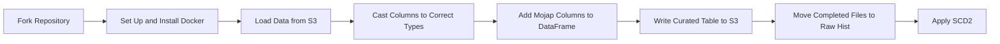

---

# Airflow & Python Example Pipeline Guide

This repository contains an example pipeline demonstrating how to create a data pipeline using Airflow, Python, Docker and MoJ's own Python modules. The pipeline performs various tasks including loading data from an S3 bucket, casting columns to correct types, adding metadata columns, writing curated tables to S3, moving completed files to a raw hist folder, and applying slowly changing dimension type 2 (SCD2) transformations.

---

### Fork Repository

1. Navigate to the [airflow-de-intro-project](https://github.com/moj-analytical-services/airflow-de-intro-project) repository on GitHub.com.
2. Click **Fork** in the top-right corner.
3. Select the owner (moj-analytical-services) for the forked repository.
4. Rename the forked repository as `airflow-de-intro-project-{username}`.
5. Optionally, provide a description for your fork.
6. Click **Create fork**.

---

## Set Up and Install Docker

Docker is used to containerize the pipeline. Follow these steps to set up and install Docker:

1. **Install Docker Desktop**: If you're using a MacBook, download and install Docker Desktop from [here](https://docs.docker.com/desktop/install/mac-install/).

## Testing Docker Image

Follow these steps to build and test your Docker image locally:

1. **Clone Repository**: Clone the Airflow repository to your local machine.

2. **Navigate to Directory**: Open a terminal session and navigate to the directory containing the Dockerfile using the `cd` command.

3. **Build Docker Image**: Build the Docker image by running:
   ```
   docker build . -t IMAGE:TAG
   ```
   Replace `IMAGE` with a name for the image (e.g., `my-docker-image`) and `TAG` with the version number (e.g., `v0.1`).

4. **Run Docker Container**: Run a Docker container created from the Docker image by running:
   ```
   docker run IMAGE:TAG
   ```
   This will execute the command specified in the Dockerfile's CMD line.

5. **Pass Environment Variables**: If your command requires access to resources on the Analytical Platform, such as data stored in Amazon S3, pass the necessary environment variables to the Docker container. Example:
   ```
   docker run \
       --env AWS_REGION=$AWS_REGION \
       --env AWS_DEFAULT_REGION=$AWS_DEFAULT_REGION \
       --env AWS_ACCESS_KEY_ID=$AWS_ACCESS_KEY_ID \
       --env AWS_SECRET_ACCESS_KEY=$AWS_SECRET_ACCESS_KEY \
       --env AWS_SESSION_TOKEN=$AWS_SESSION_TOKEN \
       --env AWS_SECURITY_TOKEN=$AWS_SECURITY_TOKEN \
       IMAGE:TAG
   ```

6. **Debugging**: For debugging and troubleshooting purposes, start a bash session in a running Docker container by running:
   ```
   docker run -it IMAGE:TAG bash
   ```

## Pipeline Tasks

### Load Data from S3

- Load dataset from an S3 bucket and return it as a Pandas DataFrame. 
- Three parquet files, representing extractions from a source database, are found in data/example-data/ in this repository, with mojap metadata found in data/metadata/. These have been adapted from [sample-csv-files](https://github.com/datablist/sample-csv-files) "people-100000.csv".
- Utilize the `read()` method of an `arrow_pd_parser` reader object.
- [Arrow PD Parser](https://github.com/moj-analytical-services/mojap-arrow-pd-parser).

### Cast Columns to Correct Types

- Compare data types of each column in the DataFrame and ensure they match with the expected types from the provided Mojap Metadata.
- [Mojap Metadata](https://github.com/moj-analytical-services/mojap-metadata).

### Add Mojap Columns to DataFrame

- Add a set of columns to the DataFrame and metadata derived from environment variables for traceability.
- Columns to add:
  - "mojap_start_datetime"
  - "mojap_image_tag"
  - "mojap_raw_filename"
  - "mojap_task_timestamp"

### Write Curated Table to S3

- Write transformed data to an appropriate S3 bucket in .parquet format.
- Register the table with the Glue Catalogue.
- Utilize AWS Wrangler for this task.

### Move Completed Files to Raw Hist

- Move processed files from the Land folder to the Raw Hist folder for maintaining a history of data sources over time.

### Apply SCD2

- Apply slowly changing dimension Type 2 (SCD2) transformations based on the mojap_start_datetime column to handle updates to data entries.
- Further instructions to be provided.

---

Follow these steps to complete the tasks outlined in the pipeline.

### Example Python Functions

Use the provided Python functions as a guide to implement each stage of the pipeline in your environment.

---


